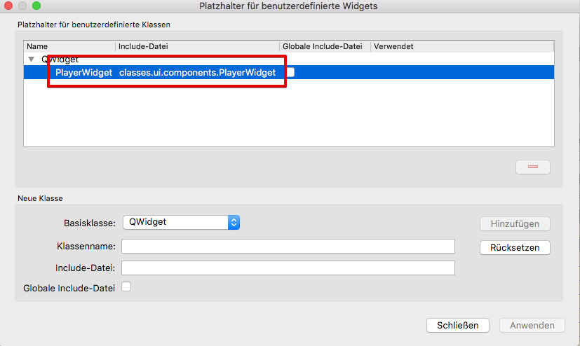

Developer's Diary
====================

During my first days with PyQt I learned a lot of things: Python, Qt, architectural concepts, project organisation, you name it.
The sheer flood of information and concepts to learn are overwhelming.
So I decided to write a Developer's Diary, to keep track of the things I learn, why I made some specific decisions,
document the progress.

27.10.2018
--------------

### .ui-Files with QtDesigner

Today I experienced with QtDesigner, creating a .ui-File for the player widget - it worked like a charm, no fiddling, no
debugging, just load the .ui-File with PyQt5.uic.loadUi, that's it! I'm a bit surprised it was so easy....

### Resources

For the UI file, I want to use FontAwesome icons, the SVG version. Qt knows "resource files", which easily can be
defined within QtDesigner, too.

After defining the resources, they can be used within QtDesigner.
But they are not automatically available within the running program: You have to compile the resources and import them in the
main program.

I created a Makefile to generate the resource files:

* `make` builds all resource files (`.qrc`), using `pyrcc5`, in the `resources/` dir.
* in the app.py main program, the resources need to be imported: `import resources.icons`, for example.

Super-easy, too, if you know how.

### Use own widgets in QtDesigner

I plan to create several custom widgets as own classes with a .ui file. Therefore I need to use those widgets in QtDesigner,
e.g. to "patch" them together in the main window.

I found out that this is possible in QtDesigner, using the Placeholder for Widgets functionality: You can right-click
on a widget and choose "Set as placeholder for defined class": You then can define the class that will be injected during runtime.

**Important:** The include file must be the Python module defining the class, not a c header file:



The widget then can be used in QtDesigner. Only drawback: It is only an empty placeholder, so no UI is shown.

### Loader animation with animated gif

I wanted to indicate loading / busy status globally in the status bar of the main widget, using an animated gif.
This was surprisingly easy:

* create a QLabel with a QMovie, which takes an animated gif
* Add the widget to the main window's statusbar with 'addPermanentWidget'
* Make a show/hide function/slot in the QApplication class to show/hide it from anywhere

### First steps with non-gui-Threads

Since one of the first tasks in the application would be to scan a dir for sound files, I read about running long-running workers.
Qt knows QThreadPool and QRunnable: A thread management system designed for that case.

Basically one runs a Task (QRunnable) in a thread pool, and can signal the ui thread via standard signals.
I had some difficulties at the beginning, because a Worker that inherits from QRunnable cannot (or it seems not to) define
singals directly: To define signals, the class must inherit from QObject, and that seems to be interferring with QRunnable.

After outsourcing the singnals (`finished`, e.g.) into its own QObject-based class, it worked as expected.

22.10.2018 - Idea collection
-----------------------------

Today I did not program much - I just found / read some new Qt concepts:

* `QSetting`: This is an easy-to-use mechanism for storing / reading application settings in a platform-independant way.
  I will use this mechanism for all settings-related things.
  @see http://doc.qt.io/qt-5/qsettings.html
* QML: I just read about the QML architecture as an alternative to widget-based UI creation: QML is an own language
  by itself to define UIs including interactions, which then can be loaded / connected to C++/python code.
  Start here: http://pyqt.sourceforge.net/Docs/PyQt5/qml.html and here: http://doc.qt.io/qt-5/qmlapplications.html
  It MAY be a bit complex to start with - I have to read some more first.
* The alternative is a QWidget based architecture, but using .ui files (from the visual QtCreator / QtDesigner).
  I installed qt5-qtdesigner from macports, which allows to create .ui files. For integrating them in python,
  see here: https://stackoverflow.com/questions/2398800/linking-a-qtdesigner-ui-file-to-python-pyqt#2500905, and
  the official PyQt doc: http://pyqt.sourceforge.net/Docs/PyQt5/designer.html

After reading a bit about QML and QWidget based approaches, I think I go for the QWidget Approach using QtDesigner and .ui-files.
For desktop-based apps, it seems to be the easier / better approach.


20.10.2018 - Qt Basics
-------------------------

Today I learned the core concepts of Qt, and how to use them via PyQt. What I learned so far:

* QWidget: The base UI class: All UI widgets are QWidgets. A QWidget has a layout, and the layout contains
  child widgets.
* Slots / Signals: Others will call them Events and Listeners, but the concept is the same: Components can offer
  signals, which can be consumed or "directed" to slots (which are the event listener functions).
  * Signals must be defined class wide with `pyqtSignal()`
  * Slots MAY be defined as class methods and annotated via `@pyqtSlot()`

### The Manager

I decided to de-couple most of the "background service" functionality into Service classes, with a singleton Manager to
get access to them.
A first service is the `MPlayer` service, which is a derived `QMediaPlayer`, to manage the whole play / playlist management in a
central location, decoupled from UI components.

The Manager class is available as singleton Manager object. To access the services, I decided to make them available on-demand
by using Python "Properties":

Python properties: you can define access methods for private class attributes using "properties":
I decieded to define properties to access the singleton service instances as a Getter property. I learned about the
`@property` decorator, which defines getter/setter for a private class attribute. Very neat!

### The first UI components - LogWin and PlayerWidget

I created the first UI components:

* LogWin is a window showing a simple text panel that contains all log entries that are produced: It connects to the Logger class
  via signal/slot mechanism, and outputs the logged messages in the text fields.

* PlayerWidget is a panel showing the acutual playing song, with play controls (play, pause, stop, duration, seek bar).
  It listens (via slots) on signals from the MPlayer service.
  I decided in the same time to ONLY use the concept of Playlists - Qt already offers that concept with `QMediaPlaylist`.
  I will use that feature thourough the application.


19.10.2018 - first steps
--------------------------

Before I really started I played a bit with the project structure - How do I organize the Python files / classes?
I want to organize things in a OO way, so use OO classes where ever possible.

The easiest way that I figured out is to keep all classes in a folder structure, one class per .py file, while those class files acts as
python modules at the same time - Instead of explicitely creating real packages with a `__init__.py` file, I decided to just
drop them in folders: That way I can use them as python modules without further configs.

So I came up with the following structure:

```
./
 +-- classes/
 | +-- [sub-folder]/[Class].py
 +-- app.py
```

app.py is the main program, all other files are going into sub-folders in classes/.


18.10.2018 - the beginning
----------------------------

This is the day I start LMP "Lexus Music Player". The main motivation for this project is to learn Qt, in combination with
Python. So I searched for a useful project that can be implemented as a "classic" standalone UI application, which
brought me to the idea of a music player - because iTunes sucks!

I started writing a very brief requirements spec down - just some ideas that came to my mind.

### First things first - pip, venv and Qt as requirement

I started by setting up a rudimentary virtual env - python3 has this already included, and it is really easy to use:

`python3 -m venv folder/`

then

`source folder/bin/activate`

and your're ready to go.

Then installing Qt with pip was really simple:

`pip install PyQt5`
and for writing a requirements file:
`pip freeze > requirements.txt`

Voilà!

### First steps with Qt

Then I did a very brief PyQt Hello World - no surprises here: It just ran out of the box.


